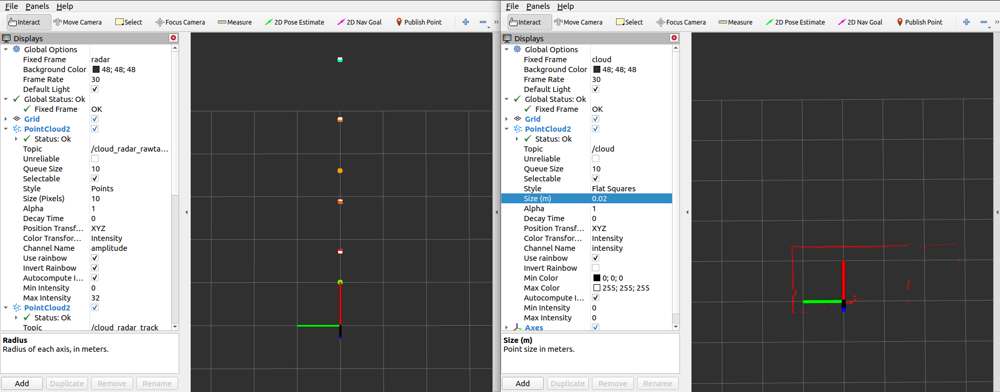

# RMS_1xxx and LMS_1xxx combination

This tutorial shows how to combine a RMS_1xxx radar with a LMS_1xxx lidar. 

To demonstrate the lidar/radar combination, a RMS_1xxx and a LMS_1xxx device were put into operation. The sick_scan_xd driver and rviz were started on ROS-1 Linux. Bagfiles have been recorded to demonstrate the required transform (rms_1xxx_lms_1xx_movement_off.bag and rms_1xxx_lms_1xx_movement_on.bag). 

Run the following steps:

1. Connect RMS_1xxx and LMS_1xxx and start sick_scan_xd with launchfiles sick_lms_1xxx.launch and sick_rms_1xxx.launch:
   ```
   roslaunch sick_scan sick_lms_1xxx.launch
   roslaunch sick_scan sick_rms_1xxx.launch
   ```
   Make sure, that different ros node names and different IP-addresses are used.

   The following rviz screenshot shows both pointclouds:
   

   Note that each sensor has its own frame id and coordinate system. The RMS_1xxx uses the frame id "radar", the LMS_1xxx uses the frame id "cloud". To combine both sensor, we have to transform the radar frame and coordinates to the lidar frame and coordinates.
   Radar targets have multiple echos due to reflection.

2. Start a ros static_transform_publisher to convert radar frames (frame id `/radar`) to lidar frames (frame id `/cloud`):
   ```
   rosrun tf static_transform_publisher 0 0 0 0 0 0 /cloud /radar 100
   ```
   Using this transform, rviz displays both the radar and lidar pointcloud:
   

Note: If you use this example with a playback of bagfiles (e.g. `rosbag play --loop ./rms_1xxx_lms_1xx_movement_off.bag`), you might encounter errors due to different timestamps (the recorded timestamps in the bagfiles are different from the timestamps by the static_transform_publisher).

Alternatively, the radar frame id and an optional transform can be configured in the radar launchfile (parameter "frame_id" and "add_transform_xyz_rpy").
