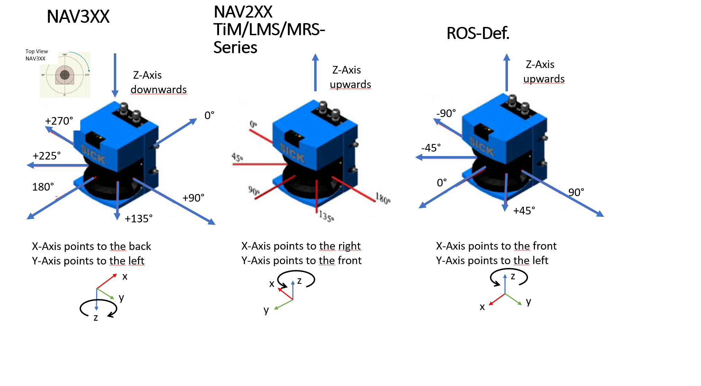

# Coordinate transforms

Different lidars use different coordinate systems. sick_scan_xd transforms all points of the published pointclouds to the ROS coordinate system, independant of the lidar. The following figure shows the commonly used coordinate systems:



An additional coordinate transform can be applied to the pointcloud. This optional transform can be used to transform the pointclouds into a user defined coordinate system. If the lidar is e.g. mounted on a vehicle, the pointclouds can be transformed into a vehicle coordinates.

An additional coordinate transform can be configured by a 6D pose (x, y, z, roll, pitch, yaw) with a translational part (x, y, z) in [m] and a rotational part (roll, pitch, yaw) in [rad].

If configured, it will transform the pointcloud from its "cloud" coordinates into user defined "world" coordinate system: 

`T[world,cloud] with P_world = T[world,cloud] * P_cloud` (parent: world, child: cloud)

The final rotation is defined by: Rotation = Rot[yaw] * Rot[pitch] * Rot[roll] with roll = rotation about x-axis, pitch = rotation about y-axis and yaw = rotation about z-axis.

An additional transform can be configured in the launchfile, e.g.

```
<!-- Apply an additional transform to the cartesian pointcloud, default: "0,0,0,0,0,0" (i.e. no transform) -->
<!-- Note: add_transform_xyz_rpy is specified by 6D pose x, y, z, roll, pitch, yaw in [m] resp. [rad] -->
<!-- It transforms a 3D point in cloud coordinates to 3D point in user defined world coordinates: --> 
<!-- add_transform_xyz_rpy := T[world,cloud] with parent "world" and child "cloud", i.e. P_world = T[world,cloud] * P_cloud -->
<param name="add_transform_xyz_rpy" type="string" value="0,0,0,0,0,0" /> 
```

Default value is `"0,0,0,0,0,0"`, i.e. no additional transform will be applied.

The additional transform applies to cartesian lidar pointclouds and visualization marker (fields).
It is **NOT** applied to polar pointclouds, radarscans, ldmrs objects or other messages.

Note that sick_scan_xd configures an additional transform using (x, y, z, roll, pitch, yaw). In contrast, the ROS static_transform_publisher uses commandline arguments in order x, y, z, yaw, pitch, roll. 

Example using ROS static_transform_publisher with x=0, y=0, z=0, roll=15, pitch=-10, yaw=5 [deg]:

```
source /opt/ros/noetic/setup.bash
# static_transform_publisher x y z yaw pitch roll frame_id child_frame_id period_in_ms
# tf_echo <source_frame> <target_frame>
# rot_x = 5 deg: 0.0872665, rot_y = -10 deg: -0.1745329, rot_z = 15 deg: 0.2617994
rosrun tf static_transform_publisher 0 0 0 0.2617994 -0.1745329 0.0872665 parent_frame child_frame 100
rosrun tf tf_echo parent_frame child_frame
```

File [trafo_example.py](sick_scan_api/trafo_example.py) demonstrates how a transform can be computed. 
